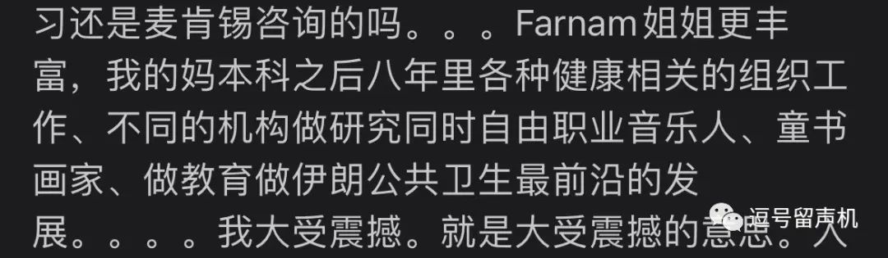

# 五一五，只破不立：一个比较的角度
作者：19级逗号

已获作者转载许可
> 免责声明：我即将从一个十分个人化的角度去展开，但写下的都是我认为具有代表性的部分。如果你自知会被文里的自以为是冒犯到作者对你的受到的情感伤害不负责，毕竟我一直是混沌中立的。

最近看到绩点改革的提案对大家为“立”做出的努力感到很敬佩，但无论过去自己想的还是现在看的方案都觉得只是一个起始点，还没有到达能够解决问题的地步。在伯克利交流的一个学期见识到了非常不一样的教育理念、评价体系，我从一开始“这教学水平也和龙大差不多”到“我知道龙大系统让我痛苦在哪了”有很强烈的写些什么的冲动，借着学期完结和五一五事件的引子我想从一个比较的角度说的是我们愤怒的本质在哪，或者说是什么造成了我们的痛苦。很抱歉只破不立，但这些原因是我曾经在漩涡中没能意识到的，因此想记录下来给过去的我和还在挣扎的其他人。
 

 

一个简单的回顾，五一五指学校一专业交流会后学生对绩点赋分制度怨气的集中爆发。虽然热度只有一两天（典），但明显积怨已久。认真追溯起来，我是2020年的大一下、大二上开始频繁地对各种课程安排、评价制度进行反思，混着新冠时代的爱无能满打满算难受两年了。那时我的的疑惑可能和很多现在感到愤怒的同学相似：我们为什么这么累？以及为什么努力没有相应的收获？

 

在五一五之前我基本不认为这两个疑问来自学校的系统性问题，因为每当我试图从外校的A-率处找证据，只会得到她们也是30%上下的答案。而除开龙大一些极端的课程会给到20%以下，四院（经管，数据，理工，人文）我接触到的课都在25%-35%范围内波动，和无论东南西北方的学校都没有什么差异。那时我还只能看到A-率这个最明显的教育评价指标，想着既然大家都是30%的A-率，我在龙大地狱（名词作动词）大概是我的问题了。

 

伯克利项目开始前了解到她们选课有个民间网站，叫BerkeleyTime，上面会有着历年所有教授的给分分布（如图，是的！是整个分布！）。每个学生都公平地知道“这门课教什么、什么评价、老师风格、给分的历史情况”，之后再来选择课程。而过去我在龙大每年选课都要开出OneNote笔记本一个无边缘限制的大页来排课、记信息搜资料，在私聊、朋友圈、论坛、公众号里面通过口耳相传来挖掘信息。选课的时候我甚至还没上飞机，就已经被第一次打醒，原来这些过往课程信息不是学校的秘密，不应该和往年试题有一样的保密级别。

 

 

## 限制/信息/快乐

> 设置上限。公开信息。快乐学习。

 

我以前会说小学校就是信息传得快，两层关系就够认识所有人，想知道什么到处问问就好了。但巨型综合性大学的完善系统告诉我，真正公平有效的信息反而是因为它大才得以实现。学生不被要求和其他学生有紧密的联系，学校系统负责把每个人接入同样的信息网络内，能公开的有益的信息百分百公开，而涉及学术严谨性的禁止资料没有人能拿到。黑白分明。

 

反卷第一步是大大小小的评价方法都要有“提前公布的”、“指引明确的”要求。设置一个小部分人（按你龙标准就30%吧）可达到的作业满分标准，只要过了就统一归入A档，那自然没有人会费尽心思为最后一点奇思妙想卷到深夜。

 

对这点印象最深刻的是一些经济专业课。曾经一门课有几个5分的作业要求对数据用进给定方法分析并且写个报告。第一次作业我跟着文档列出来的步骤做完再小小精加工后拿到成绩一看4.7分，因为没有具体的评价只好发邮件去问，教学助理回复我说因为没有完成一个隐藏任务：用问卷里多个结果变量来交叉验证。但这个要求从没有在课堂、导修、作业文档里提到过，虽然评分是公平的但这个分数难道是用于检验谁拥有先验知识的吗？困惑，我已经懂了为什么要上课。

 

 

第二次作业我把一切讲过的没见过的、要求没要求的小点都做了，和同学讨论一个题目表达不清的点到最后一刻。但也没有满分，原因无非又是一些做法偏离了教授标答。无所谓了，我盯着那零点几分哭笑不得。

 

即使心里很清楚这零点几分影响不了什么，但你说一点不膈应吗，不可能。很多拿4.6、4.7分的同学基于作业那时给出的信息，无论是答案还是理解都是值得拿个满分的，这是一种学习里必要的正反馈。不过题外话，这零点几分还真的可能就把一位同学从3.7卡下3.3。在意也不算毫无道理。

 

作业是为了学习设置的，区分评价不过是一种激励机制，如果为了合理的区分度而牺牲学习效率你我都知道骂一句本末倒置。作业应该是基于已经学习的内容进行复习和实践，有时可以有“带引导”的推展，否则只出没人做得出题、没人知道的要求，学生做作业除了变得更迷惑还会收获什么吗？

 

在作业中得到的新知识主要来自于交作业前努力达到老师的要求，但如果老师都不明确指出达标的方向学生就只能在五花八门的地方倾尽心思。最后有些卷的方向必然不符合要求导致扣分，这些学生就会有强烈的“努力没得到回报”的心理产生。我把彩虹的红橙黄绿逐一打磨，结果给分点任意地落在蓝色，更有意思的是上课只说了什么是彩虹没说里面有什么颜色。你说这样的作业里我什么都没收获吗？也不能这样说，只是是在盯着邮件的懊悔中学到的罢了。但别忘记了我本来在可以维持着心理健康的同时在做作业的时候就跟着明确的要求学到该学的东西。

 

如果这里的教育更认同通过强烈的情感记住一个知识点而非在实践中获得知识，那现在做得挺好的，当我没说。

 

在伯克利交流遇到过评价要求明确的老师，也遇到过出作业题比较强调拓展思维的老师。前者给要求和步骤相当明确，要不就是小课上明确教你一个操作怎么实现，要不就是作业文档上字字句句写好要做什么及其对应分值。分数就是你想拿就能拿，好好学习的来者不拒。后者的作业做起来比较痛苦，但一般会“随机分配”一个小组来讨论，助教会在评分后写半页纸告诉你为什么哪个步骤不太符合一般做法问题在哪。

 

注意，我不是谴责助教的工作方法，而是希望学校能多在助教上投入一些并且设立好制度来鼓励更有能力的助教任职。

更重要的，无论哪种作业都是分等级给分（比如这里的check plus）。另一门课程我的第一次作业人生地不熟卷出了一份二十页的报告，同学表示很诧异。之后我发现系统上面会标出哪个小题没有满足哪个答题点所以扣两分，只要在一定范围内波动作业成绩都是A+。我像是来到新世界，慢慢意识到可以要求什么只做什么，A是4.0、A+也是4.0 ，一定范围内都是同一等级必然不用费尽心思，有这个时间去睡觉不好？

 

这种满分带来正向鼓励的作用也是我之前没有意识到的。大二上计量的时候老师说他把期末考总分设置成170是因为虽然本质是一样的，但大家看到分数都会开心一点。我当时圈的重点是“本质都是一样的”，比如博弈论作业每次最后一个10分开放题，达到所有要求就给8分，非常惊艳才给满。我们大家的作业分数于是经常撑死就98。我安慰自己：本质其实就98满分，没关系的。

 

但其实有关系的，重点应该圈在“大家都会开心一点”。每次付出很多的作业还回来总是差那么一点，心理暗示常常是我不够好。既然还有进步的空间（其实几乎没有了）就一直挣扎在边缘。拿100/102和拿98/100真的没区别吗？我现在回想在龙大的学习状态，总是会想到那只前面被吊了根胡萝卜的驴，被控制着做一些无所谓的低回报挣扎，还乐此不疲。

 

或许现在的放假氛围里大家已经不太记得期末时的压抑氛围，但那个时候窒息的感觉飘过太平洋都没有减弱。我过去的期末周反正是一个比一个更痛苦，到了大三上顶峰时甚至在新图过了三四个晚上。一直坐在拓展屏前处理三四个坑坑洼洼的期末项目，打印几堆厚厚的资料，想睡就趴一下、渴了就喝燃茶。以至于现在这些元素出现在我面前还是会生理性反胃，包括闻不得那时候很喜欢的香水阳光琥珀。

 

但结果也就那样，我也没有因为在猝死边缘凌晨走回上园睡个觉就4.0。如果我现在见到这只驴，或者我回去后又变回这只驴我想和她说，没有吃到那根胡萝卜不是因为你不配，是这个系统根本没打算让你吃。累。

 

在伯克利大家的感受就是非常不一样，正正常常的期末周劳作，虽然休息不多但也从没有什么崩溃。看到草坪上的羊驼还有图书馆的naked run会想，这点压力我还不需要发泄（。）反正结果是来交流的一群从地狱卷出来的龙大朋友很大一部分都直接4.0/4.0。笑着学，吃到了应得的萝卜。

 

抛开是否学到知识和有没有正反馈不谈，现在的考核体系也是不公平的。考试用不用往年卷子就不谈了，让可能泄露的题目出现在考试里简直和笑话一样。但作业就不一样了。一个课程的作业很难每年都完全不同，一方面找题和编写解答都是相当费时间的，一直重新编质量很难保证。

 

还记得我们的前提是作业是学习导向而非考核导向吗，要求作业一直变化显得没有必要。但在现在的考核方式里，作业得分的标准差非常大，因为有些要求就是满足不了、有些题就是超出课程范围。加上作业占比动辄20%、40%，有没有拿到往年作业答案就显得差别极大。

 

我交流前几周加过一些数理课，无论东西半球大家都要处理往年旧题的问题。我看到一种让我颇为震撼的方式是：全部公开。几乎每一门课上课的时候都有一个专属的网页（如图），上面简单一点的会有过往所有课程材料包括习题和答案，更强一点的往年录播课所有都上传了，零圆购直接学。这样就保证了公平性，可能获得的额外信息全部公开，google搜一个课程编号你乐意用往年题练习就能练习，而不用费尽心思看哪里找一下“传家宝”。

 

 

信息不透明的状况下，只能说人情社会的特点会表现得淋漓尽致，人脉可以低成本地换信息换高分。你没办法谴责要到答案的人，这不违规而且她们也是通过自己的人脉换得的，但没有拿到答案的人不难受是不可能的。没有公平性可言，但也鲜有学生着手试图改变现状，因为每个人都是潜在的受益者，谁知道下一节课拿到答案的是不是自己呢？那应该寻求改变的就是设计课程的老师，比如不发标准答案、比如稍改一下题。

 

如果出的题是复习性的，那么每个合理努力的学生都会得到满分，问题不大；如果出的题是拓展性的，应该随机分配小组，为不论是否本专业的每个人平等地提供和同辈交流的资源，不要让分数体现人脉广度和对答案能力。两种都很好，也都还很少见。

 

至此假设我们解决了各种评价方法中不合理的部分，但是即使蛋糕按劳分配了，我们的蛋糕还是这么小。这里的小不是说学生学术能力弱，而是说大家都争抢同一个蛋糕，期望的出路高度一致，所以接下来我们眼光从学业移开谈谈：

 

## 多样性/目标/......

 

组内相关系数表示一个单位彼此之间相似的程度。假设我大学期间认识了同级1000个同学，但大家在论坛上都关心“大一暑假不实习是不是只能去考GRE”，那组内相关系数激进点算作1，我其实就认识了一个人。

 

多样性其实是一个非中国本土语境下出现率非常高的词，比如世界大学排名里面就说她们看重校园组成的多样性，又比如我在公交车上听对面少数族裔妹妹说自己选大学很注重多样性。但我曾经选大学的标准如果可以排个第一二三的话多样性不会进入前十的列表。多样性于我一直是个相当空的概念，我从没感到过多样性的缺失有什么坏处，我甚至对多样性是否匮乏缺少判断力。结果就是现在我在龙大，结果又是我曾经感到不对劲却找不到原因。

 

其实龙大在疫情前也是宣传自己多样性的。我还记得大一上论坛会讨论逸夫书院哪一层的印尼同学特喜欢闹聚在一起开派对，英语课能遇到腼腆的韩国同学，宿舍楼层有个金发碧眼的妹妹每天早上坐在栏杆边上看报纸……但都是相当久远且深知不复返的场景了。

 

但我说的多样性并不局限在国籍民族上，更重要的是周围的人做出选择的多样性。有个都市传说是这样写的：你是你最熟悉五个朋友的平均值。虽然大家都在互联网上冲浪看各种各样的人生，但对我们影响最大的还是真正接触的身边人。这些人更可能和我们面对相似的现实限制，如果我接触的实实在在的人能做到，那我也很可能能做出同样的选择。我身边人选择的差异越大，我感受到我拥有可能性就越多，互联网和传记上的人生更多是遥远的故事罢了。

 

也不是说龙大绝对地单一，我也见过非常多人做出或大或小的勇敢选择，只是学校整体上选择的多样性相比正常值小太多了。先不说专业少得没有综合性大学的样子，就算是一个专业内大家的目标都出奇地一致。

 

之前看过一个申请分享，学姐说研究生入学后和招生官聊天，招生官和她感慨你们学生的简历仿佛像说好的一样：大一校外实践，大二实习，大三科研……其实大一入学时大家都迷茫不知道大学四年怎么安排（是的要安排哦），然后前辈们就会根据自己的经验传授一条路，近年来CPDO也加入此列提供“官方指引”。

 

这些路口口相传、迭代优化，慢慢就变成大家相似的几乎能被量化的简历：三段实习+一段科研+社团活动等等，仿佛这些经历都是可加的，又仿佛一样活了四年大学经历的事情能够比出个高下。

 

这种“每个人都是不一样的烟火”的烂俗话术很容易变成壁炉上的圣诞袜子，挂在高高的地方供着但绝对不会穿在脚上。很多人看过就笑一下最后感慨一句，还是要现实。

 

稍微不一样点就不现实了吗？怎么不现实呢？因为就会申请不了前xx的研究生项目了，因为就不能直博了，因为就去不了大厂、因为走点弯路就没办法在35岁前进入管理层步入正轨。一步错步步错呀。热知识：人生不止三十五岁。虽然大家都知道人生还长，但真的把这个知识运用到自己的人生决策里其实不简单，特别是当身边的人都以要早早安稳下来要买房买车为目标时，你很难用“未来四十年都要做一样的事好无趣”就不甩甩手不争这个赛道。

 

我过去接触的人都很好，但那样的环境里我活成了一个“对人生很有规划的人”，似乎明白想要什么，更重要的是为这些目标都设定了时限。硕士两年，助研两年，博士六年，教职长聘六年六年又六年，人生几十年可以在我掰手指之间安排明白。因为这就是大家从小看的《小故事，大道理》里面，“美国商人”教给自己小孩的人生道理：计划你的人生。也是高考给我们带来的习惯：找一个目标，做好计划，然后达到它。更重要的是周围的环境就是大家都安排好自己，仿佛没有明确的目标和喜好是亟需改变的，那我便觉得这样的生活可能无聊，但存在趣味，且相当正常。但目标达到的结果真的是你需要的喜欢的吗？还是你喜欢的是有目标本身呢？

 

我开始真正质疑自己是在遇到计量课的小组成员后（而有意思的是我加这节课也是出于常见的“出去交流可以修一些博士生课”的建议）。虽说是农业经济学博士项目的必修课，我们组凑巧大部分都是不同院系来的，她们介绍自己是商院管理项目的、是公管院健康项目的、是做发展的……基于“大家基本都是刚读完硕士比我大两三岁吧”的理念，一个月下来我都在用和同龄人相处的模式与她们愉快聊天。直到2月25日（仔细翻了那天半夜发狂写下的东西）我突然从蛛丝马迹中感觉到“或许她们比我想的要有阅历得多”，遂进行了搜索引擎的使用。遂震惊。

 

她们的人生轨迹是跳跃的、激情的，是找到了想做的事情就一口气都做了，同时不会说我现在就要全身心地忘我地做什么。就算在研究所做助理，一边也能够开音乐会、做童书；做健康的时候对AI感兴趣了那就开个支线执行。读博一个常见的劝退理由是心理健康，招生委员会也会评价你是否有survive（字面意思）这个长期项目的品质。看到Farnam这样的人我就知道博士学位只是她人生中一个附加的尝试，没有什么押上全部身家的精神高度紧张，她要是不乐意了读得没意思了那直接退学也不会有什么损失。我把两种人生放在面前，分别对自己说“这是你未来十年的人生”，我很确信我只对Farnam这样的活法感到兴奋。

 

但她不是个例，我整体接触到的普遍有跃动的人生体验。发展经济学讲完unconditional transfer的课后一个学生走来和教授探讨自己为组织的为乌克兰难民免费发放食物的项目有什么改进空间；周五下午五点学校里各处地上趴着学生在沥青路上画反对某食品公司的宣传彩画；校门口的社团摊位每天都有人值守，学生政府到处发信息宣讲自己的纲领拉票；比较政治学一个发言上蹿下跳的同学说自己以后要当政客，数学课上印度学生发现老师也一样在用数学写歌……

 

龙大也有这样的人，但在那里都是个例；我说的是一种整体鲜活的氛围。只有身边不停地看到大家有能力做出选择我才可以慢慢改掉我自己那点执念，既然她们可以我也行吧。这中间真的没有很大不同，不同的不过是给自己设定的约束、给自己划定的底线。我认为龙大的住宿专业混寝、通识课走班都是在鼓励我们认识不一样的人，这样的制度非常好，可惜就是在认识越来越多人之后更绝望地意识到同质化。这不是在上述那些教学模式下可以做出的改变，而是涉及到了招生招聘策略与话语、开设专业、学校定位等等相当本质的东西。我知道一个常有的玩笑是龙大没有给人大学的感觉，但在这里几个月几个不同专业的朋友一起聊天只能叹息着坚定：过去两年多真的没有大学的感觉。

 

龙大教学质量非常好（就我的专业而言），好到我交流完还是只会说“教学上没有什么区别”，甚至因为学生都非常能奇思妙想地努力而让我们的学生水平超群。但是龙大的学习状态与生活状态真的让人觉得十分遗憾，对我来说学到的冷知识是：等量的知识可以高效地、快乐地学到，即使在偏僻的地方上学也可以每天迎着太阳骑车冲下坡、买一堆杂货回家炖个牛肉、周末可以去海边坐坐可以爬山看看。或许是我在深圳“不够努力”地生活，但我其实没有变，我在让环境改变我而已。

 

虽然结尾这样写有种happy ever after的嫌疑，但确实是希望龙大更好的，只是在指出缺点的同时没有办法看到改革的着手点充满了无力感，也很难过一些大一大二的同学已经从挣扎变成了绝望。我们试着改变世界，但如果世界无法改变……

 

也可以逃到月球。

 

二零二二年五月二十六日，

于伯克利交流结束时写下

